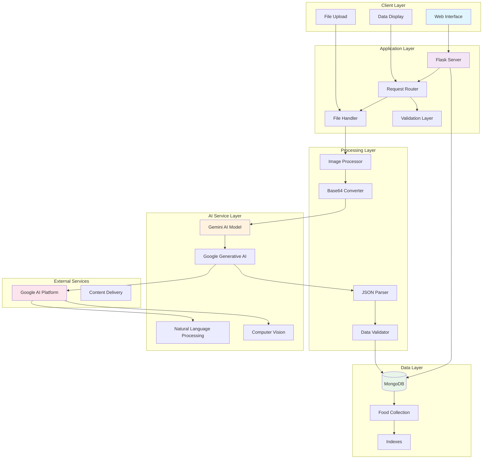

# Food Analyzer

A web application that uses AI-powered image analysis to provide comprehensive nutritional information about food items. The system leverages Google's Gemini AI model to analyze uploaded food images and extract detailed nutritional data, health benefits, and dietary information.

## Table of Contents

- [Overview](#overview)
- [System Architecture](#system-architecture)
- [Features](#features)
- [Technology Stack](#technology-stack)
- [Prerequisites](#prerequisites)
- [Installation](#installation)
- [Configuration](#configuration)
- [Usage](#usage)
- [API Endpoints](#api-endpoints)
- [Database Schema](#database-schema)
- [Contributing](#contributing)
- [License](#license)

## Overview

The Food Analyzer application enables users to upload food images and receive detailed nutritional analysis including macronutrients, micronutrients, health benefits, allergen information, and dietary classifications. The system stores analysis history and provides a comprehensive web interface for viewing past analyses.

## System Architecture



## Features

### Core Functionality
- **Image Upload and Processing**: Supports multiple image formats (PNG, JPG, JPEG, GIF, BMP, WebP)
- **AI-Powered Food Recognition**: Uses Google Gemini 1.5 Flash model for accurate food identification
- **Comprehensive Nutritional Analysis**: Provides detailed macronutrient and micronutrient information
- **Health Benefits Assessment**: Identifies key health benefits and dietary properties
- **Allergen Detection**: Identifies potential allergens and dietary restrictions
- **Storage and Preparation Guidance**: Offers practical food handling recommendations

### Data Management
- **Analysis History**: Persistent storage of all food analyses with timestamps
- **Image Storage**: Base64 encoded image storage for complete analysis records
- **Data Retrieval**: RESTful API for accessing historical analyses
- **Data Deletion**: Secure removal of individual analysis records

### User Interface
- **Responsive Web Design**: Mobile-friendly interface for all devices
- **Real-time Analysis**: Immediate feedback during image processing
- **Visual Data Presentation**: Structured display of nutritional information
- **History Management**: Browse and manage previous analyses

## Technology Stack

### Backend
- **Framework**: Flask (Python web framework)
- **AI/ML**: Google Generative AI (Gemini 1.5 Flash)
- **Database**: MongoDB (NoSQL document database)
- **Image Processing**: Pillow (PIL)
- **Data Serialization**: JSON

### Frontend
- **Templates**: Jinja2 templating engine
- **Styling**: CSS3 with responsive design
- **JavaScript**: Vanilla JS for dynamic interactions
- **File Handling**: HTML5 File API

### Infrastructure
- **Cloud AI**: Google AI Platform
- **Database Driver**: PyMongo
- **Security**: Werkzeug security utilities
- **Configuration**: Environment-based settings

## Prerequisites

- Python 3.7 or higher
- MongoDB 4.0 or higher
- Google Cloud Platform account with Generative AI API access
- Modern web browser with JavaScript enabled

## Installation

1. **Clone the Repository**
   ```bash
   git clone https://github.com/your-username/food-analyzer.git
   cd food-analyzer
   ```

2. **Create Virtual Environment**
   ```bash
   python -m venv venv
   source venv/bin/activate  # On Windows: venv\Scripts\activate
   ```

3. **Install Dependencies**
   ```bash
   pip install flask google-generativeai pymongo pillow werkzeug
   ```

4. **Install and Start MongoDB**
   ```bash
   # On Ubuntu/Debian
   sudo apt-get install mongodb
   sudo systemctl start mongodb
   
   # On macOS with Homebrew
   brew tap mongodb/brew
   brew install mongodb-community
   brew services start mongodb-community
   
   # On Windows
   # Download and install MongoDB Community Server from mongodb.com
   ```

## Configuration

1. **Google AI API Setup**
   - Create a project in Google Cloud Console
   - Enable the Generative AI API
   - Create an API key
   - Replace the API key in the application:
     ```python
     GEMINI_API_KEY = "your-actual-api-key-here"
     ```

2. **MongoDB Configuration**
   - Ensure MongoDB is running on default port (27017)
   - The application will automatically create the database and collection
   - For production, configure authentication and connection pooling

3. **Security Configuration**
   ```python
   app.secret_key = 'your-secure-secret-key-for-production'
   ```

4. **Environment Variables** (Recommended for production)
   ```bash
   export GEMINI_API_KEY="your-api-key"
   export MONGODB_URI="mongodb://localhost:27017/"
   export SECRET_KEY="your-secret-key"
   ```

## Usage

1. **Start the Application**
   ```bash
   python app.py
   ```

2. **Access the Interface**
   - Open your browser and navigate to `http://localhost:5000`
   - The application will be accessible on all network interfaces

3. **Analyze Food Images**
   - Click the upload area or drag and drop an image
   - Wait for AI analysis to complete
   - View comprehensive nutritional information
   - Access analysis history through the interface

## API Endpoints

### Core Endpoints

| Method | Endpoint | Description | Parameters |
|--------|----------|-------------|------------|
| GET | `/` | Main application interface | None |
| POST | `/upload` | Upload and analyze food image | `file`: Image file |
| GET | `/history` | Retrieve analysis history | None |
| GET | `/analysis/<id>` | Get specific analysis | `id`: Analysis ID |
| DELETE | `/delete/<id>` | Delete specific analysis | `id`: Analysis ID |

### Request/Response Examples

**Upload Endpoint**
```bash
curl -X POST -F "file=@food_image.jpg" http://localhost:5000/upload
```

**Response Format**
```json
{
  "success": true,
  "food_data": {
    "food_name": "Apple",
    "category": "Fruit",
    "calories_per_100g": "52",
    "nutritional_info": {
      "protein": "0.3",
      "carbohydrates": "14",
      "fat": "0.2",
      "fiber": "2.4",
      "sugar": "10",
      "sodium": "1"
    },
    "health_benefits": ["Rich in antioxidants", "Supports heart health"],
    "allergens": [],
    "dietary_restrictions": ["Vegan", "Vegetarian", "Gluten-free"]
  },
  "image_base64": "data:image/jpeg;base64,/9j/4AAQ...",
  "original_filename": "apple.jpg"
}
```

## Database Schema

### Food Analysis Document Structure

```javascript
{
  "_id": ObjectId,
  "timestamp": ISODate,
  "original_filename": String,
  "image_base64": String,
  "analysis_date": String,
  "user_session": String,
  "food_data": {
    "food_name": String,
    "category": String,
    "calories_per_100g": String,
    "nutritional_info": {
      "protein": String,
      "carbohydrates": String,
      "fat": String,
      "fiber": String,
      "sugar": String,
      "sodium": String
    },
    "vitamins_minerals": {
      "vitamin_c": String,
      "vitamin_a": String,
      "iron": String,
      "calcium": String,
      "potassium": String
    },
    "health_benefits": [String],
    "allergens": [String],
    "storage_tips": String,
    "preparation_suggestions": [String],
    "serving_size": String,
    "glycemic_index": String,
    "dietary_restrictions": [String]
  }
}
```

## Data Flow

1. **Image Upload**: User uploads food image through web interface
2. **Validation**: File type and size validation performed
3. **Processing**: Image converted to base64 format for storage and API transmission
4. **AI Analysis**: Image sent to Google Gemini API with structured prompt
5. **Data Extraction**: JSON response parsed and validated
6. **Storage**: Analysis results and image stored in MongoDB
7. **Response**: Structured data returned to client interface
8. **Display**: Results rendered in user-friendly format

## Error Handling

### Client-Side Validation
- File type restrictions (images only)
- File size limits (16MB maximum)
- Required field validation

### Server-Side Error Management
- API connection failures with graceful degradation
- Database connection error handling
- Image processing error recovery
- JSON parsing fallback mechanisms

### Response Codes
- `200`: Successful operation
- `400`: Bad request (invalid file, missing parameters)
- `404`: Resource not found
- `413`: File too large
- `500`: Internal server error

## Security Considerations

### Input Validation
- File type whitelist enforcement
- Filename sanitization using Werkzeug
- File size limits to prevent DoS attacks
- Base64 encoding validation

### Data Protection
- Session-based user tracking
- Secure filename handling
- API key protection (environment variables recommended)
- Input sanitization for database operations

## Performance Optimization

### Image Processing
- Efficient base64 conversion
- Image format optimization
- Memory management for large files

### Database Operations
- Indexed queries for faster retrieval
- Connection pooling for concurrent requests
- Optimized document structure

### AI API Usage
- Structured prompts for consistent responses
- Error handling for API rate limits
- Response caching considerations

## Deployment

### Development
```bash
python app.py
```

### Production Considerations
- Use production WSGI server (Gunicorn, uWSGI)
- Configure reverse proxy (Nginx, Apache)
- Set up SSL/TLS certificates
- Configure environment variables
- Set up monitoring and logging
- Implement backup strategies for MongoDB

### Docker Deployment
```dockerfile
FROM python:3.9-slim
WORKDIR /app
COPY requirements.txt .
RUN pip install -r requirements.txt
COPY . .
EXPOSE 5000
CMD ["gunicorn", "--bind", "0.0.0.0:5000", "app:app"]
```

## Monitoring and Logging

### Application Monitoring
- Request/response logging
- Error tracking and alerting
- Performance metrics collection
- AI API usage monitoring

### Database Monitoring
- Query performance analysis
- Storage usage tracking
- Connection pool monitoring
- Backup verification

## Contributing

1. Fork the repository
2. Create a feature branch (`git checkout -b feature/new-feature`)
3. Commit your changes (`git commit -am 'Add new feature'`)
4. Push to the branch (`git push origin feature/new-feature`)
5. Create a Pull Request

### Development Guidelines
- Follow PEP 8 style guidelines
- Add comprehensive error handling
- Include unit tests for new features
- Update documentation for API changes
- Ensure backward compatibility

## License

This project is licensed under the MIT License - see the LICENSE file for details.

## Support

For support and questions:
- Create an issue on GitHub
- Check the documentation
- Review existing issues and discussions

## Acknowledgments

- Google Generative AI for powerful food recognition capabilities
- MongoDB for flexible document storage
- Flask framework for rapid web development
- PIL/Pillow for robust image processing
